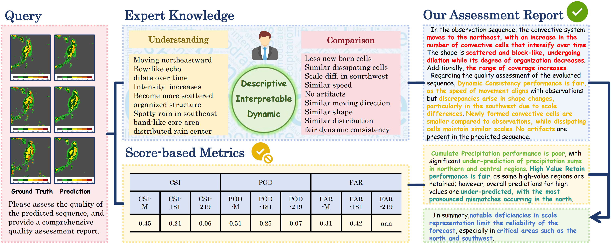

<div align="center">
<h1> RadarQA: Multi-modal Quality Analysis of Weather Radar Forecasts </h1>
</div>
<h5 align="center">
    <a href="todo">🌐 Homepage</a> | <a href="https://huggingface.co/datasets/hexmSeeU/RQA-70K">🤗 Dataset</a> | <a href="https://arxiv.org/pdf/2508.12291">📑 Paper</a> | <a href="https://github.com/hexmSeeU/RadarQA">💻 Code</a> | <a href="https://huggingface.co/hexmSeeU/RadarQA-7B">🤗 Model</a> 
</h5> 

## 📢 News

- **[2025-12-27]** We have released the **Training and Evaluation Scripts** ! 
- **[2025-09-18]** RadarQA has been accepted by **NeurIPS 2025** !
- **[2025-09-15]** We have released the  **Model**, and **Dataset** !
- **[2025-08-12]** We have released the  **Paper** !

---

## 🧩Overview of RadarQA 

We introduce RadarQA, an MLLM-based weather forecast analysis method that integrates key physical attributes with detailed assessment reports. We introduce a novel and comprehensive task paradigm for multi-modal quality analysis, encompassing both single frame and sequence, under both rating and assessment scenarios. To support training and benchmarking, we design a hybrid annotation pipeline that combines human expert labeling with automated heuristics. With such an annotation method, we construct RQA-70K, a large-scale dataset with varying difficulty levels for radar forecast quality evaluation. We further design a multi-stage training strategy thatciteratively improves model performance at each stage. Extensive experiments show that RadarQA outperforms existing general MLLMs across all evaluation settings, highlighting its potential for advancing quality analysis in weather prediction.

<p align="center">
  
</p>

---

## 🚀 Usage

### Installation

We conduct training and inference using <a href="https://github.com/modelscope/ms-swift">ms-swift</a>, an awesome framework that supports fine-tuning and deployment of large-scale and multimodal models. 

```bash
conda create -n ms-swift python=3.10
conda activate ms-swift
git clone https://github.com/modelscope/ms-swift.git
cd ms-swift
pip install -e .
```

For evaluation, first set up the environment using the following scripts:

```bash
conda create -n radarqa_eval python=3.10
conda activate radarqa_eval
pip install openai tqdm bert_score rouge_score nltk evaluate
```

Then, you need to download additional tokenizer resources for scorers:

| Model             | Download                                                         |
| ----------------- | ------------------------------------------------------------ |
| `bert-base-uncased` | [google-bert/bert-base-uncased](https://huggingface.co/google-bert/bert-base-uncased) |
| `nltk_data`         | python /RadarQA/eval/download_nltk.py                                |

⚠️ **Notice**: since `bert_score` does not support loading models from a local path by default, a manual modification is required. please modify the model loading logics in `/miniconda3/envs/RadarQA_eval/lib/python3.10/site-packages/bert_score/scorer.py` as follows:

```python
# self._model = get_model(self.model_type, self.num_layers, self.all_layers) # the original code that needs to be commented out
from transformers import AutoModel
self._model = AutoModel.from_pretrained(model_path) # the new code that needs to be added
```

Also, add `model_path` to the parameter list of the initialize function.

### Data Preparation

You can fetch the full dataset from <a href="https://huggingface.co/datasets/hexmSeeU/RQA-70K">RQA-70K</a>. After downloading, unzip the `images` folder. A valid directory structure should look as follows:

```
RQA-70K/
└──images/
    ├── 6k_img_brief/
    ├── 6k_seq_brief_v1/
    ├── 6k_seq_frame_v1/
    ├── 15k_img_detail/
    ├── 15k_seq_detail_v1/
    └── 15k_seq_frame_v1/
```

The organized data structures are provided in `RadarQA/data` directory with relative image / video paths. To convert them to absolute paths, you can use `/data/add_prefix.py` by setting the `prefix` to the absolute path of **RQA-70K**.

### Inference Preparation

You can fetch our model from <a href="https://huggingface.co/hexmSeeU/RadarQA-7B">RadarQA-7B</a>, which is a 7B model fine-tuned on <a href="https://huggingface.co/Qwen/Qwen2.5-VL-7B-Instruct">Qwen2.5-VL-7B-Instruct</a>.

### Training

RadarQA adopts a three-stage training pipeline. In the first stage, we perform supervised fine-tuning on large-scale multimodal data to equip the model with basic task solving capabilities. In the second stage, we use reinforcement learning and carefully design two reward functions for the rating task. In the third stage, we apply post-training with a small set of samples to further refine performance.

All the training scripts are in the `train` folder. You need to specify the corresponding model path and output path for training. After completing each stage, you need to run `merge_lora.sh` to merge the LoRA weights and use the merged model path as the input for the next training stage.

|  Training Script   |                      Description                       |
| :----------------: | :----------------------------------------------------: |
| `train_stage_1.sh` |           Supervised fine-tuning on RQA-70K.           |
| `train_stage_2.sh` | Reinforcement learning based on GRPO for rating tasks. |
| `train_stage_3.sh` |      Post-training to further refine performance.      |
|  `merge_lora.sh`   |     Merge the LoRA weight and pre-trained weight.      |


### Inference

After merging the LoRA weights, you can directly follow the method provided by ms-swift to load the model for inference. We also provide a batch inference script to facilitate evaluation on the test set:


```bash
cd inference
bash inference_img.sh # for image
bash inference_seq.sh # for sequence
```

For inference with closed-source models, we provide scripts to generate predictions on the test sets of the four tasks. The resulting outputs are saved under the `/inference/close-sourced` directory. For each task, the files in its corresponding subdirectory are used as follows:

| Scripts              | Description                                                  |
| -------------------- | ------------------------------------------------------------ |
| `generate.py`        | The main logic for generating predictions, performing inference in parallel using `concurrent.futures` |
| `auto_gen.sh`        | Can be used directly to ensure all samples are generated, handling API connection errors by repeatedly running `generate.py`. |
| `quality_control.py` | Format validation to ensure the quality of the generated outputs and maintain fairness in evaluation. |

You can run `auto_gen.sh` to first generate all samples, then run `quality_control.py` to delete the invalid generated samples. Repeat this process until all samples are qualified.


### Evaluation

For rating tasks, we directly calculate accuracy. You need to organize your inference results into a valid JSONL format, with each samples as follows:

```python
{"response": "...", "labels": "...", ...}
```

Each sample should include both `response` and `labels`. Execute the following script to compute accuracy for open-source models:

```bash
cd eval/brief/open_source
python img_brief.py # for image
python seq_brief.py # for sequence
```

For assessment tasks, the evaluation is divided into two types:

1. Metric-based evaluation
2. LLM-as-a-Judge

Similar to rating tasks, predictions need to be organized into a valid JSONL format. Run the following code to generate scores for the different metrics:

```bash
cd eval/detail/open_source
python detail_all.py
```

For LLM-as-a-Judge, we first need to run the following script to generate the LLM evaluation results:

```bash
bash auto_gen.sh
```

After all samples are evaluated, run `parse_gpt4_score.py` to compute the GPT4-Score.

📌For closed-source models, evaluation can be performed by directly using the evaluation scripts in the corresponding `closed_source` directory.

---

## ✍️Citation

If you find RULER-Bench helpful, please cite:

```bibtex
@article{he2025radarqa,
  title={RadarQA: Multi-modal Quality Analysis of Weather Radar Forecasts},
  author={He, Xuming and You, Zhiyuan and Gong, Junchao and Liu, Couhua and Yue, Xiaoyu and Zhuang, Peiqin and Zhang, Wenlong and Bai, Lei},
  journal={arXiv preprint arXiv:2508.12291},
  year={2025}
}
```

------

## 📬 Contact

For questions or submissions, please open an issue or email **[hexuming773@gmail.com](mailto:hexuming773@gmail.com)**.
